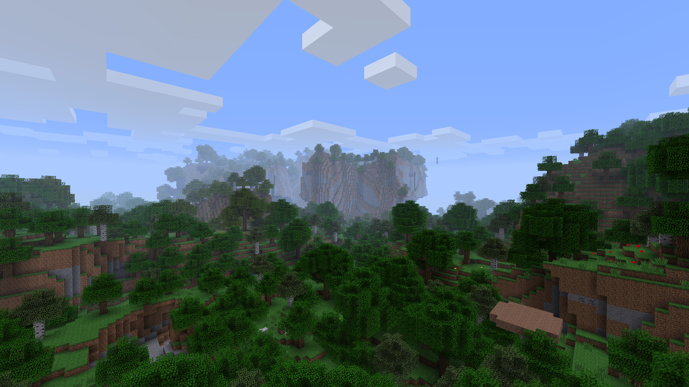
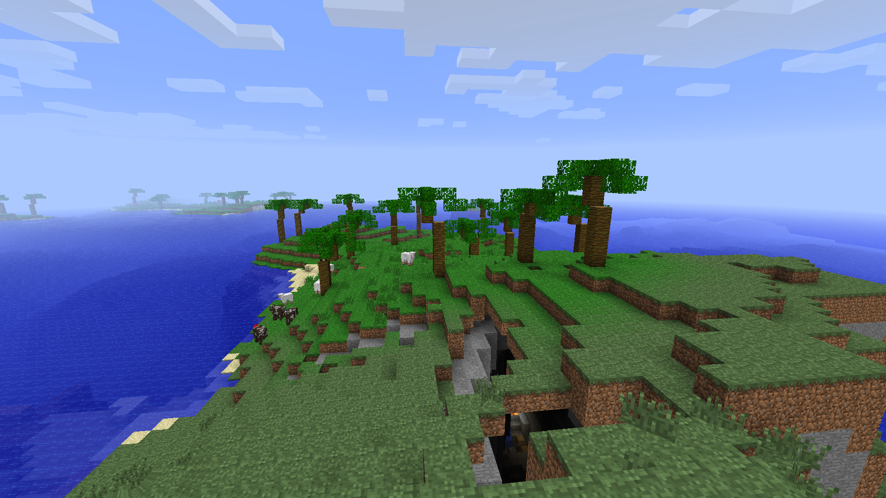
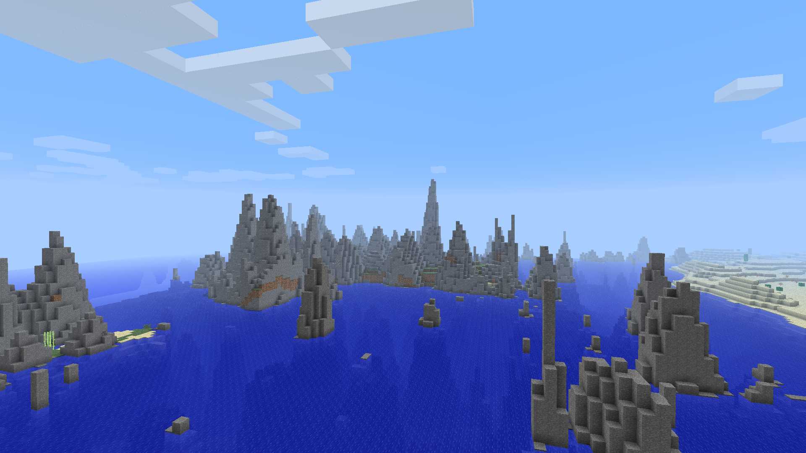

 

    

 

Minecraft Authentic Adventure is a minimalistic mod for 1.2.5 that reverts the game to a more Beta-esque aesthetic with hilly terrain generation, sandbox gameplay and an overall enjoyable experience for player from both the golden age and the modern era.

## Features
- Overhauled world generation, making it more hilly and Beta-esque
- Reworked hunger system, alongside a Classic mode
- Beta style textures
- Improved lighting engine
- Added extra challenge to Hardcore mode alongside extra benefits
- A few new enchantments

## Trailer (Youtube)

## Screenshots

