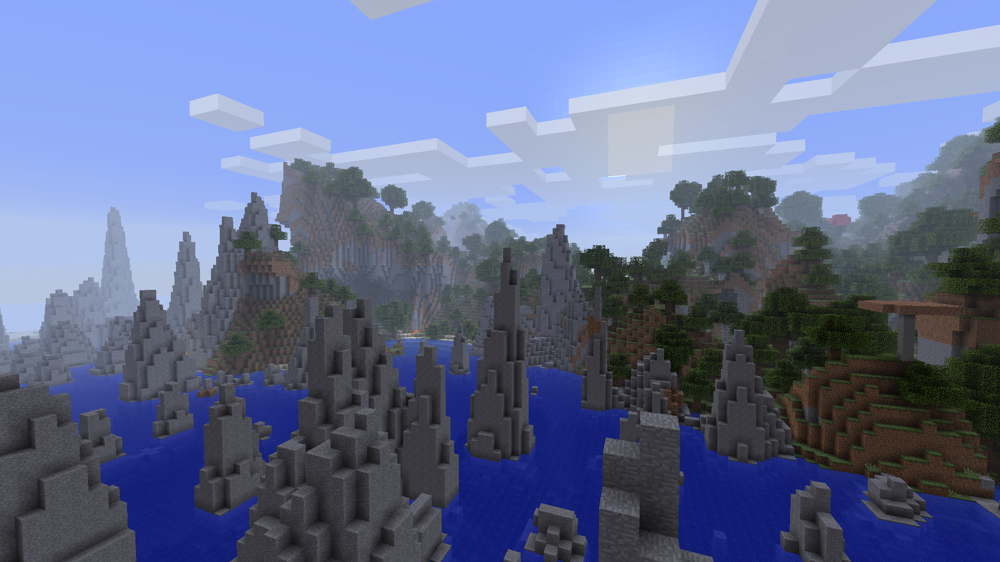
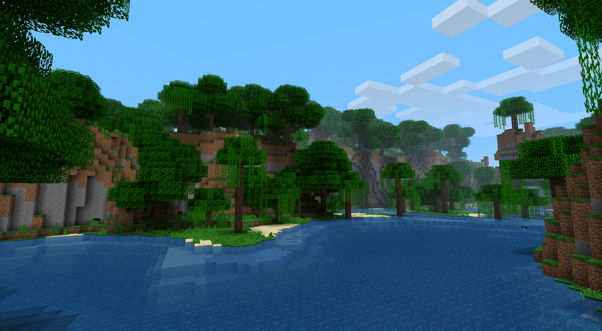
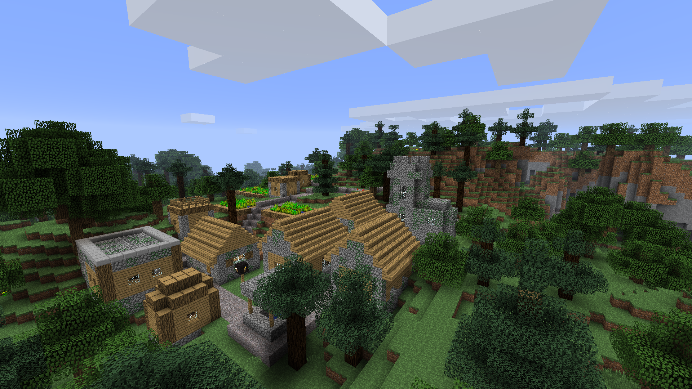
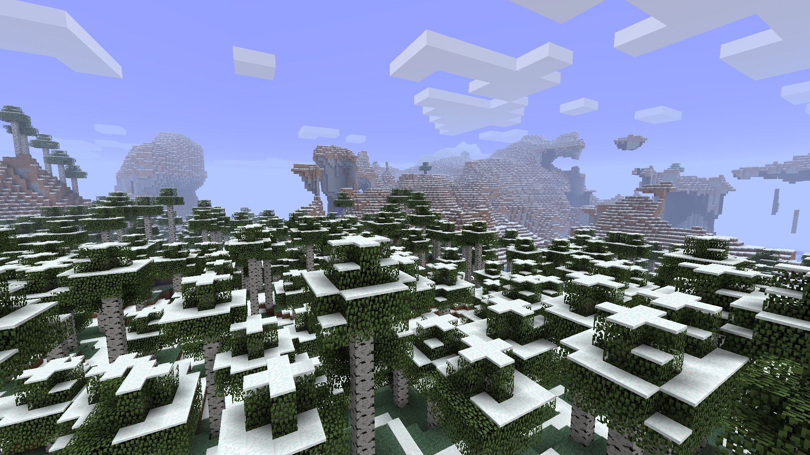
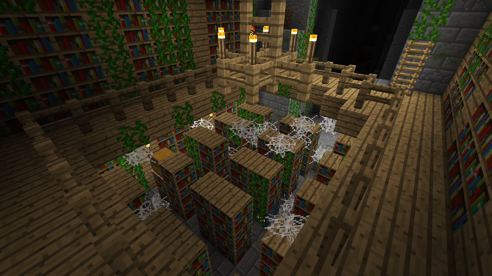
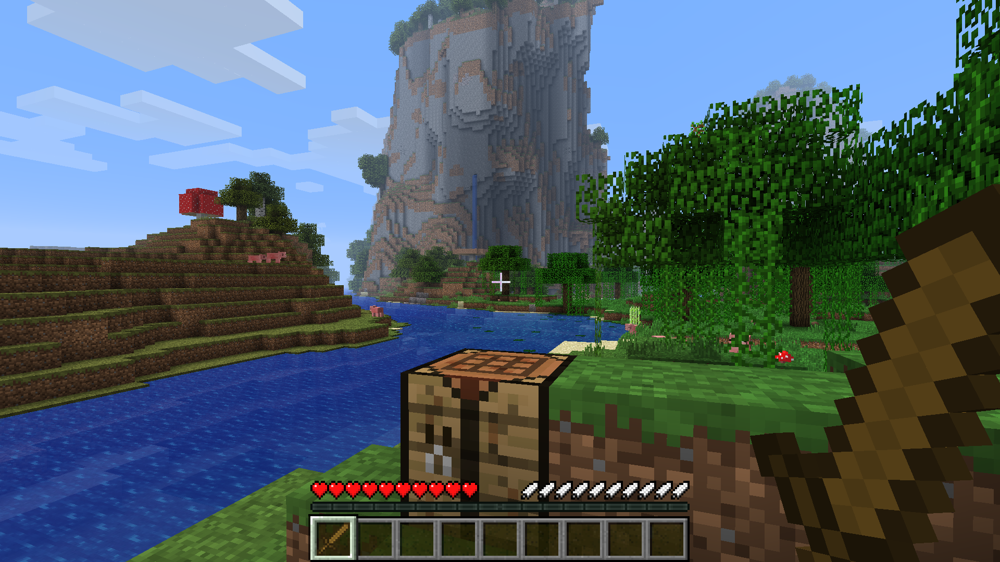

 

    

 

Minecraft Authentic Adventure (latest version: 1.3.1) is a minimalistic mod for 1.2.5 that reverts the game to a more Beta-esque aesthetic with hilly terrain generation, sandbox gameplay and an overall enjoyable experience for player from both the golden age and the modern era.

*Why don't you check out Authentic Adventure's sister project, [Minecraft Diverge](https://github.com/BlueStaggo/MCDiverge)?*

## Features
- Overhauled world generation, making it more hilly and Beta-esque
- Plenty of customisation options for world generation, gameplay and visuals to fine tune your experience
- Reworked hunger system and new classic mode
- Added extra challenge to Hardcore mode alongside extra benefits
- Improved lighting engine
- A few new items and enchantments

## Trailer for 1.0 (Youtube)

## Screenshots

