 

    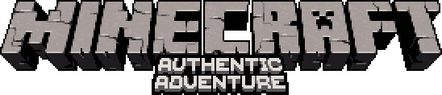

 

Authentic Adventure is a minimalistic mod for 1.2.5 that reverts the game to a more Beta-esque aesthetic with hilly terrain generation, sandbox gameplay and an overall enjoyable experience for players interested in both the golden age and the adventure update era. For a blind playthrough, it is suggested to look at the achievements menu to learn a bit about how to access new progression content.

## Features
- Overhauled world generation with extra hills and Beta-esque features
- Plenty of customisation options for world generation, gameplay and visuals to fine tune your experience
- More content added to the End to give it more purpose than merely being boss arena
- Added and tweaked tool and armor tiers for more interesting gear variety
- Reworked hunger and enchanting that brings the game closer to its roots
- Added extra challenge to hardcore mode with greater XP rewards
- Improved lighting via the Starlight engine
- A few new enchantments

## Trailers
| 1.4 Update | Initial Release |
| - | - |
|  |  |

## Screenshots
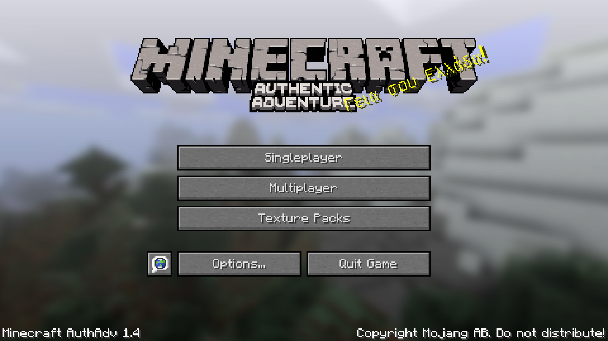
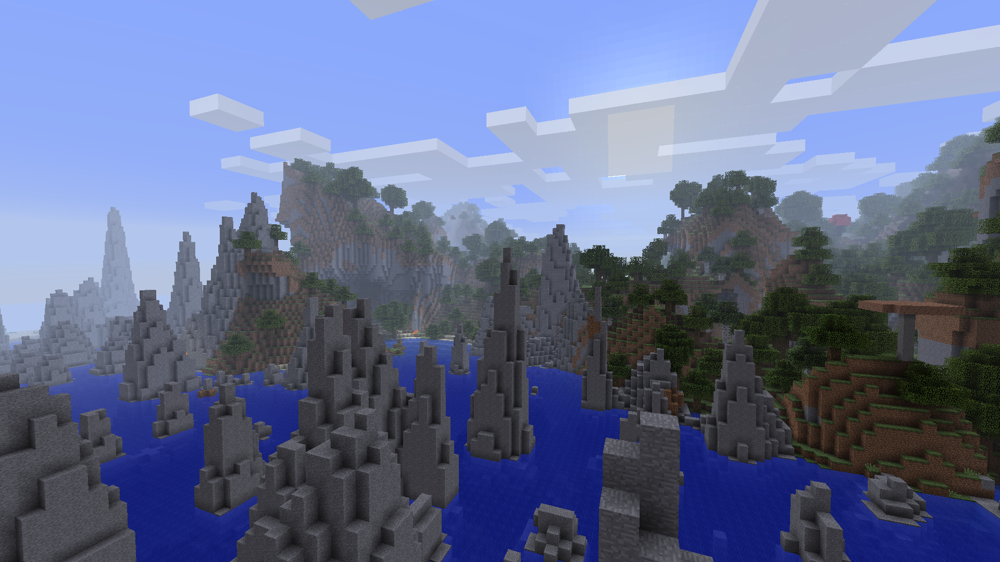
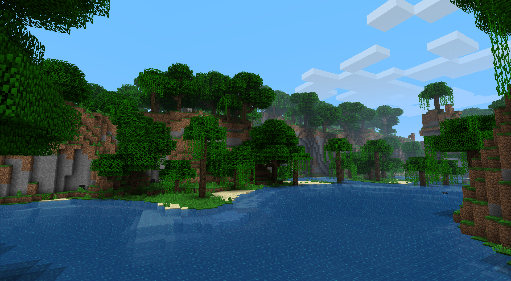
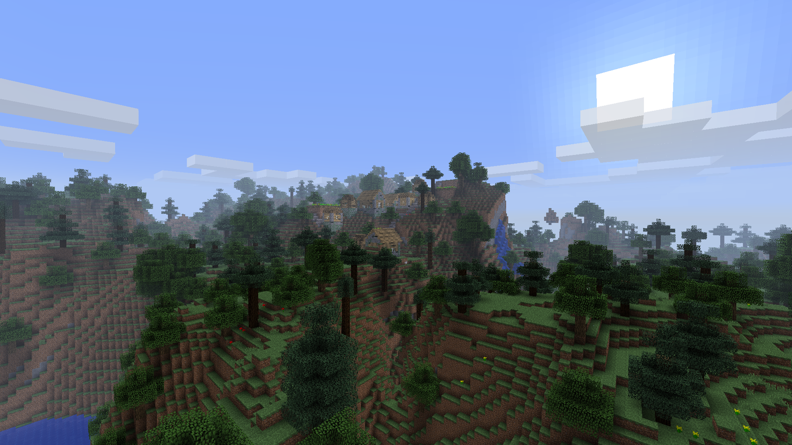
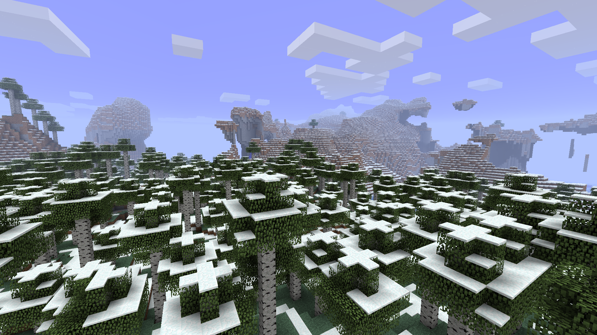
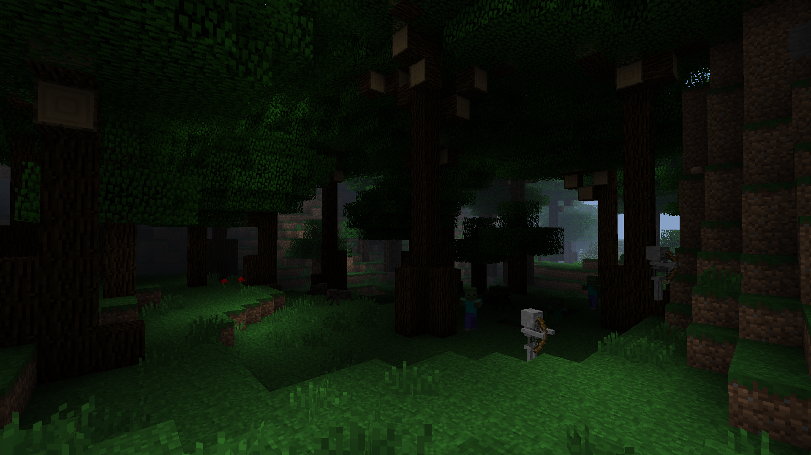
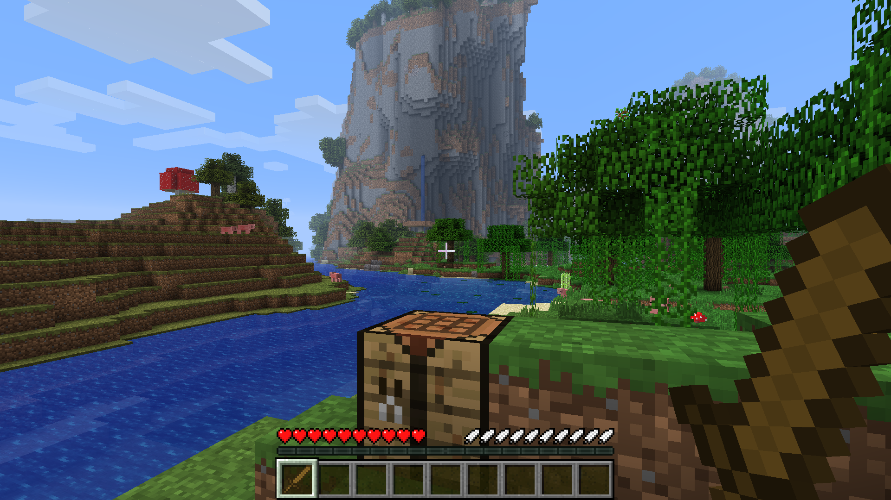
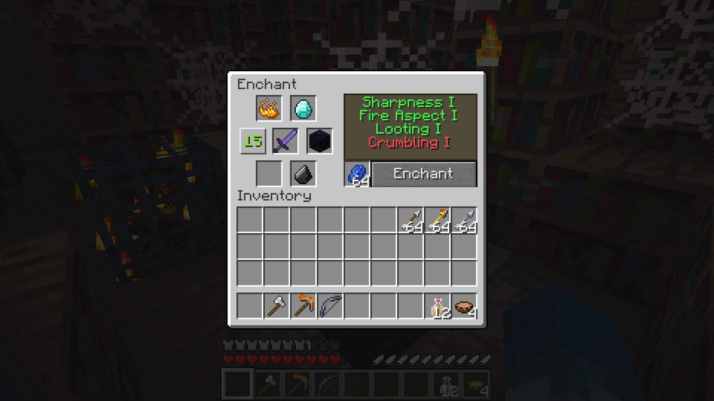
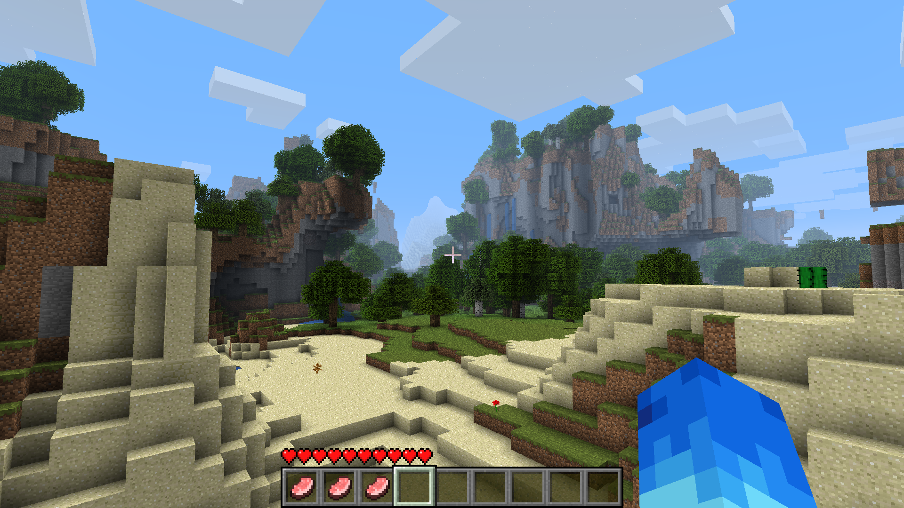
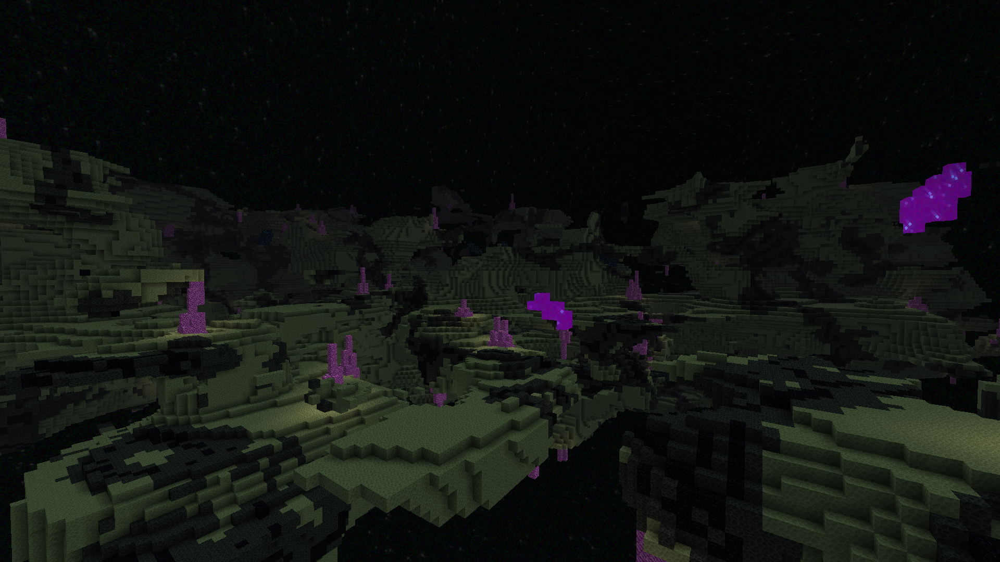

## Source Code

You need to use RetroMCP v1.2. Set up a 1.2.5 project without decompiling it, then place the "mappings.tiny", "exceptions.exc" and "merged-initial.patch" (to be renamed to "merged.patch") files in the "conf" folder while replacing all existing files. Make sure your setup is on merged side and decompile. Then put the "merged-authadv.patch" file into the "patches" folder in the root project directory (create it if it does not exist) then go to MCP > More tasks > Apply patch.

The mappings used for Authentic Adventure are slightly modified [Feather mappings](https://github.com/OrnitheMC/feather) which are used under the Creative Commons Zero license.
